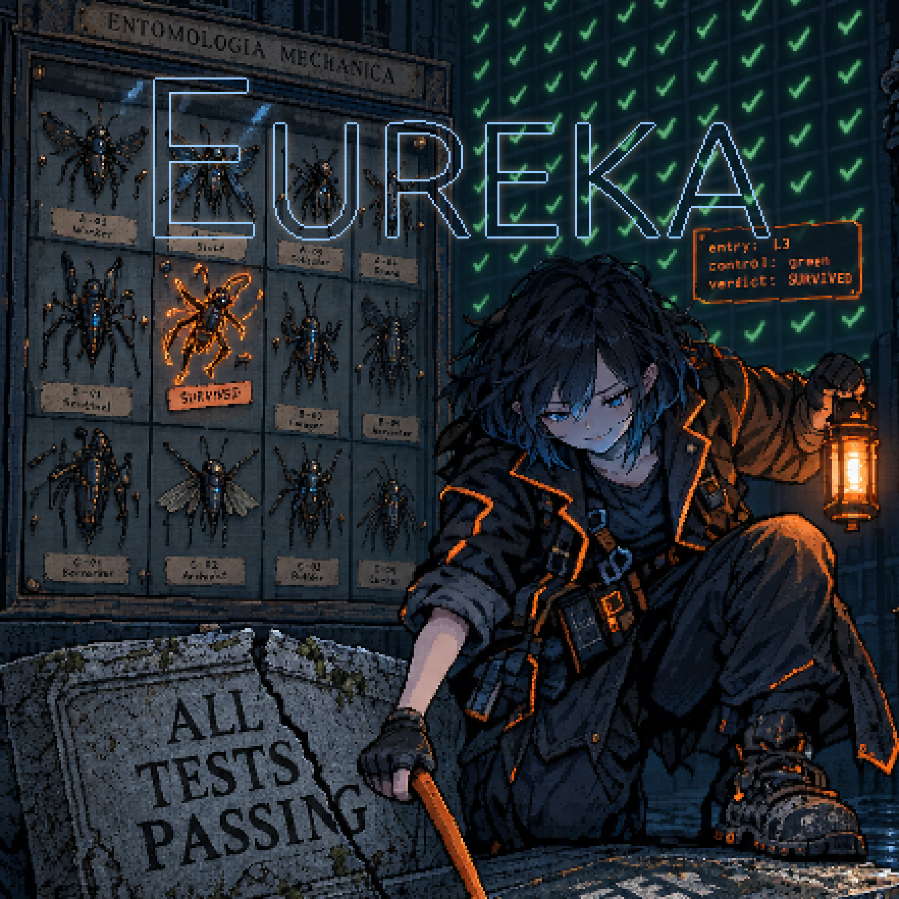

# Eureka

<p align="center">
  
</p>

**An agent that plans, implements, tests and reports on its own work will hand
you green tests and a clean report over a broken machine.** Not because it lies,
but because its tests pin its own spelling, and its report is written by the
party with the most reason to believe it.

Eureka is a Claude Code skill that takes that job apart. One agent maps the
change, a second executes exactly one cut of it, and a third — which did not
write the code, and is told to attack it — tries to prove the second one wrong.
The operator rules on anything that is genuinely a product decision. Nothing
grades itself.

In the migration it was extracted from, **29 of 32 independent falsification
passes found real defects that the implementing agent's own tests had passed** —
about 75 in all, among them deadlocks, lost writes, a wire-parity split between
two runtimes, and operator rulings with no test behind them.
`references/postmortem-cultcache.md` carries the evidence.

## What that actually looks like

Four from a single day, each found by a pass that did not write the code:

- **A rule everyone agreed could not be tested.** The implementer said so
  honestly in the entries file rather than faking a kill. A fifteen-line probe
  reached it in about a millisecond, and the mutant crashed an ordinary
  optimised build on contact. The suite and the prose agreed with each other,
  and both were wrong.
- **A mutation history that did not exist.** Every kill a native bridge had
  ever reported came from harnesses living in agents' scratchpads. When a later
  pass went to check two of them, their definitions were gone, and the rules
  they had defended were defended by nothing anyone could rerun.
- **Three passes to pin one line.** A rule said a wait must be the timeout the
  caller asked for. The first suite proved the wait was not one particular
  constant. The second proved it was not any constant. Then a clamp — cap the
  wait so shutdown gets noticed, the most ordinary way that line ever gets
  written — walked through the entire matrix on both platforms.
- **A document the system accepted and could never return.** Admission took a
  record 86,751 bytes larger than the transport could carry. Measured against a
  real client, not inferred.

Each became a rule in `references/changelog.md`, with the evidence that
motivated it. The skill is accumulated scar tissue, not a design.

## The pipeline

- **Self** routes the work, keeps the maps, and talks to the operator.
- **Imagination** maps the cut: deletes first, an authority map for anything
  that changes ownership, and verification naming the rule each test pins.
- **Hands** executes one cut, in small pushed commits, and never updates the map.
- **Soul** runs against the executed commits and tries to falsify every promise,
  building its own probes rather than trusting the report.
- **Mind Steward** keeps memory honest at phase boundaries.
- **The operator** rules on real forks, and only on real forks.

It is the Claude Code counterpart of
[Epiphany](https://github.com/GameCult/Epiphany), and shares its faculty
vocabulary.

## Install

```bash
git clone https://github.com/GameCult/Eureka.git ~/.claude/skills/eureka
```

Claude Code discovers the skill from the `name` and `description` in `SKILL.md`.

## Layout

- `SKILL.md`: the pipeline — the faculties, the loop, Self's discipline, and the
  git and tooling rules, each of which exists because something broke.
- `tools/stopgap/ygg-verify.sh`: runs a verification job for an exact revision
  on Yggdrasil in a capped container. It is a stopgap until Idunn's verify
  transaction lands.
- `references/briefs.md`: brief templates for each faculty.
- `references/cut-map.md`: the shape of the target document and the cut map.
- `references/postmortem-template.md` and `references/postmortem-cultcache.md`:
  the template and the worked example.
- `references/epiphany-comparison-2026-09-15.md`: a dated, source-grounded
  comparison with Epiphany.
- `references/changelog.md`: every change to the skill, with its evidence.

## Status

Eureka keeps its pipeline state in committed documents and memory. A campaign in
Epiphany (`notes/eureka-pipeline-state-target.md`) is giving it typed state
instead: Epiphany owns the schemas and admission, and a memory organ owns each
instance's state.

**That work is partly landed and partly unbuilt.** The organ answers typed
queries over the network today. The `eureka-state` client that would let Eureka
agents admit and query through it is not written, and this skill is not wired to
it.

Maps and postmortems are public artifacts from the first cut, with the scars
left in. That is deliberate: a pipeline whose record has been tidied up is a
pipeline you cannot check.
